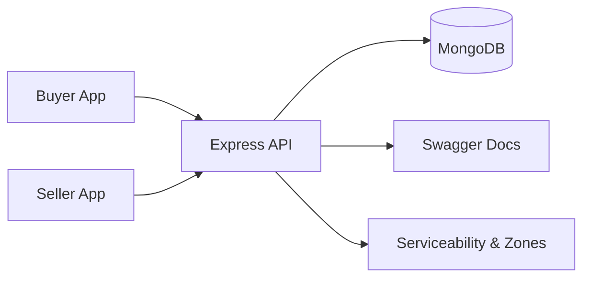

# Online Marketplace Project


A full-stack online marketplace with separate buyer and seller applications, a shared Express API, and MongoDB for persistence.

## At a Glance

| Area | What it does |
|---|---|
| Buyer app | Browse products, manage cart, place and cancel orders, comment, rate, and manage addresses |
| Seller app | Manage items, stock, delivery zones, and order status |
| Backend API | Handles auth, products, categories, orders, cart, comments, reviews, flags, payments, and serviceability |
| Database | MongoDB models with ObjectId references and populated relationships |

## Project Layout

```text
ip_team13_onlinemarket_project/
├─ server.js
├─ controllers/
├─ models/
├─ routes/
├─ middleware/
├─ services/
├─ buyer-app/
├─ seller-app/
├─ swagger.json
├─ README.md
└─ supporting docs
```

## Key Features

### Buyer Experience

- Register and log in
- Browse the catalog with search and filters
- View product details, reviews, and comments
- Add items to cart and place orders
- Cancel pending orders
- View order history and order detail pages
- Manage saved addresses and profile data
- Check delivery serviceability

### Seller Experience

- Register and log in
- Manage inventory and stock
- Create and edit items
- Assign or create categories
- Track orders and update status
- Manage delivery zones on the map
- View seller profile and received orders

### Backend Capabilities

- JWT authentication and role protection
- MongoDB schemas for users, products, categories, orders, carts, reviews, comments, flags, and delivery zones
- Product-category relationship through `ObjectId` references
- Order cancellation flow with ownership checks
- Swagger documentation for the API
- Serviceability checks for buyer and seller delivery zones

## Architecture



## Setup

### Prerequisites

- Node.js 16 or newer
- npm
- MongoDB running locally or a MongoDB Atlas connection string

### 1. Clone the repository

```bash
git clone <repo-url>
cd ip_team13_onlinemarket_project
```

### 2. Configure the backend

Create a `.env` file in the project root.

```env
PORT=5000
MONGODB_URI=mongodb://localhost:27017/online_market
JWT_SECRET=your_jwt_secret
GROK_API_KEY=your_optional_grok_key
```

### 3. Install backend dependencies

```bash
npm install
```

### 4. Start the backend

```bash
npm run dev
```

Or use:

```bash
npm start
```

### 5. Start the buyer app

```bash
cd buyer-app
npm install
npm start
```

### 6. Start the seller app

```bash
cd seller-app
npm install
npm start
```

## Scripts

### Backend

- `npm start` - start the server
- `npm run dev` - start the server with nodemon
- `npm run migrate:product-categories` - migrate legacy product categories to `ObjectId` references

### Buyer App

- `npm start` - start the buyer UI
- `npm run build` - build the production bundle
- `npm test` - run React tests

### Seller App

- `npm start` - start the seller UI
- `npm run build` - build the production bundle
- `npm test` - run React tests

## Environment Variables

### Backend

- `PORT` - backend port, default `5000`
- `MONGODB_URI` - MongoDB connection string
- `JWT_SECRET` - JWT signing secret
- `GROK_API_KEY` - optional key used for AI comment summaries

### Frontend

- `REACT_APP_API_URL` - API base URL, usually `http://localhost:5000/api`

## API Overview

All endpoints live under `/api`.

### Authentication

- `POST /api/auth/register`
- `POST /api/auth/login`
- `GET /api/auth/me`

### Products and Items

- `GET /api/products`
- `GET /api/products/:id`
- `POST /api/products`
- `PUT /api/products/:id`
- `PUT /api/products/:id/stock`
- `DELETE /api/products/:id`
- `GET /api/products/:id/reviews`
- `POST /api/products/:id/reviews`
- `DELETE /api/products/reviews/:id`
- `GET /api/items`
- `GET /api/items/categories/all`
- `GET /api/items/:id`
- `POST /api/items`
- `PUT /api/items/:id`
- `DELETE /api/items/:id`

### Categories

- `GET /api/categories`
- `GET /api/categories/:id`
- `POST /api/categories`
- `PUT /api/categories/:id`
- `DELETE /api/categories/:id`

### Cart

- `GET /api/cart`
- `POST /api/cart/add`
- `POST /api/cart/remove`
- `POST /api/cart/update`
- `DELETE /api/cart/clear`

### Orders

- `POST /api/orders`
- `GET /api/orders`
- `GET /api/orders/buyer/my-orders`
- `GET /api/orders/seller/my-orders`
- `GET /api/orders/:id`
- `POST /api/orders/:id/comments`
- `PUT /api/orders/:id`
- `PUT /api/orders/:id/status`
- `DELETE /api/orders/:id`

### Buyers and Sellers

- `GET /api/buyers/profile`
- `PUT /api/buyers/profile`
- `GET /api/buyers/addresses`
- `POST /api/buyers/addresses`
- `PUT /api/buyers/addresses/:addressId`
- `DELETE /api/buyers/addresses/:addressId`
- `GET /api/sellers/profile`
- `PUT /api/sellers/profile`
- `GET /api/sellers/items`

### Comments, Flags, Payments, and Serviceability

- `GET /api/comments/item/:id`
- `GET /api/comments/item/:id/summary`
- `POST /api/comments`
- `POST /api/flags`
- `POST /api/flags/orders/:orderId`
- `GET /api/flags/my-flags`
- `POST /api/payments/pay`
- `POST /api/serviceability/location`
- `GET /api/serviceability/location`
- `GET /api/serviceability/check/:sellerId`
- `POST /api/serviceability/check-cart`
- `GET /api/serviceability/zones`
- `POST /api/serviceability/zones`
- `PUT /api/serviceability/zones/:zoneId`
- `DELETE /api/serviceability/zones/:zoneId`

### Docs

- Swagger UI: `/api-docs`
- Swagger JSON: `/api-docs.json`

## Data Model Summary

### User

Holds buyer and seller accounts with authentication data, contact details, business info, and addresses.

### Category

Stores category names and descriptions.

### Product

Stores product details and links each product to a seller and a category using `ObjectId` references.

### Order

Stores the full order as one document, including buyer, items, totals, status, shipping data, and comments.

### Cart

Stores buyer cart items.

### Review, Comment, Flag, BuyerLocation, DeliveryZone

Support ratings, communication, moderation, and serviceability features.

## Important Notes

- `Product.category` uses a `Category` reference, not a plain string.
- Legacy category data was migrated with a one-time script.
- Order cancellation is only allowed for the buyer who owns the order and only while the order is still `pending`.
- Frontends should render populated objects safely, especially `category.name` and seller references.
- Both apps point to the backend through `REACT_APP_API_URL`.

## Troubleshooting

### Backend does not start

- Check MongoDB is running.
- Confirm `.env` exists and `MONGODB_URI` is correct.
- Make sure port `5000` is free.

### Frontend opens on another port

- React uses the next available port when the default one is busy.
- Use the port shown in the terminal.

### Category appears as an object in the UI

- Use `category.name` instead of rendering the whole object.

### `.trim()` errors on category

- That means the code expects a string but the API returned a populated object.
- Handle both object and string forms.

## Related Docs

- `PROJECT_SUMMARY.md`
- `SETUP.md`
- `QUICK_START_MAP.md`
- `MAP_FEATURE_GUIDE.md`
- `SERVICEABILITY_FEATURE.md`
- `SERVICEABILITY_API_REFERENCE.md`

## License

No license file is currently included.

---

Built for a buyer-seller marketplace workflow with a shared backend, separate frontends, and delivery-zone aware ordering.
